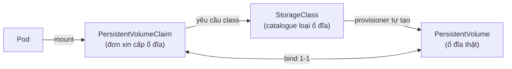
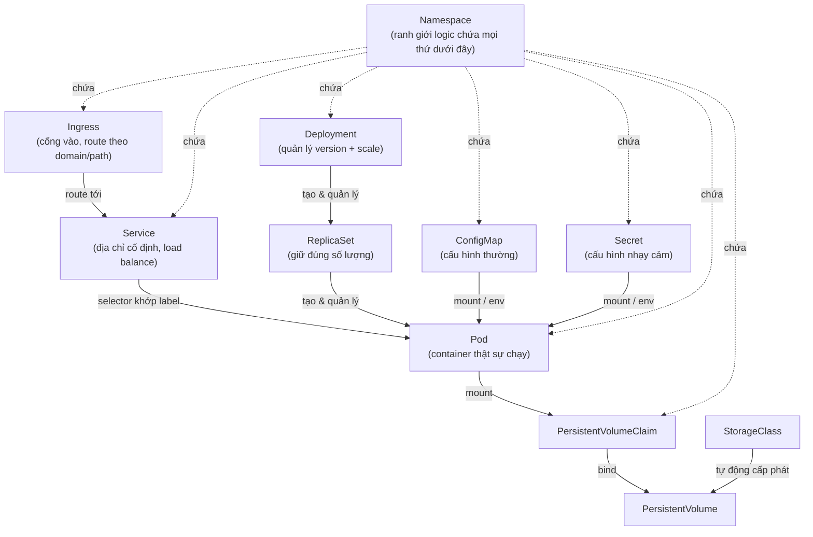

# Kubernetes Core Concepts — Giải thích dễ hiểu

File này giải thích các khái niệm **object** (tài nguyên) mà bạn khai báo trong file YAML — khác với file "6. Components in detail.md" nói về các **tiến trình nội bộ** (apiserver, kubelet...) vận hành cluster. Ở đây ta nói về "bạn viết gì, K8s hiểu là gì".

Nguyên tắc chung cần nhớ trước tiên: **mọi thứ trong K8s đều là "khai báo mong muốn" (declarative)**. Bạn không ra lệnh "hãy làm A rồi B rồi C" — bạn chỉ nói "tôi muốn trạng thái cuối cùng trông như thế này", rồi các controller (đã nói ở file 6) sẽ tự tìm cách đưa cluster về đúng trạng thái đó, liên tục, mãi mãi.

---

## 0. Labels & Selectors — thứ "dán nhãn" kết nối mọi object với nhau

Trước khi vào từng khái niệm, cần hiểu cái này vì nó là "keo dán" giữa Service ↔ Pod, Deployment ↔ Pod, và nhiều thứ khác.

**Label** = cặp key-value bạn gắn lên object, giống như dán nhãn lên hộp:
```yaml
metadata:
  labels:
    app: my-web
    env: production
```

**Selector** = điều kiện lọc "tìm mọi object có label khớp thế này":
```yaml
selector:
  matchLabels:
    app: my-web
```

Ví dụ: một Service không biết "Pod nào" cụ thể — nó chỉ biết "hãy gửi traffic tới **bất kỳ Pod nào có label `app: my-web`**". Khi Pod cũ chết, Pod mới sinh ra (cùng label) tự động được Service nhận diện, không cần cấu hình lại gì. Đây là cơ chế nền tảng cho gần như toàn bộ phần dưới.

---

## 1. Namespace — "toà nhà chia theo tầng/phòng ban"

### Ẩn dụ
Namespace giống như chia 1 toà nhà văn phòng (cluster) thành nhiều tầng/phòng ban (team A, team B, staging, production...). Mỗi phòng ban có tên riêng cho tài nguyên của mình, không đụng nhau, và có thể giới hạn quota riêng.

### Vấn đề nó giải quyết
- Nhiều team/dự án dùng chung 1 cluster mà không đặt trùng tên resource (2 team đều có Pod tên `web` — không sao, vì khác namespace)
- Áp dụng quyền hạn (RBAC) và giới hạn tài nguyên (ResourceQuota) theo từng team/môi trường

### Namespace mặc định có sẵn
| Namespace | Dùng để làm gì |
|---|---|
| `default` | Nơi resource của bạn rơi vào nếu không chỉ định namespace |
| `kube-system` | Chứa các component hệ thống (apiserver, coredns, kube-proxy...) |
| `kube-public` | Đọc công khai được bởi mọi user, kể cả chưa xác thực |
| `kube-node-lease` | Chứa object `Lease` — heartbeat của từng Node (đã nhắc ở file 6) |

### YAML ví dụ
```yaml
apiVersion: v1
kind: Namespace
metadata:
  name: staging
```

### Lệnh thường dùng
```bash
kubectl get namespaces
kubectl create namespace staging
kubectl get pods -n staging          # xem resource trong 1 namespace
kubectl config set-context --current --namespace=staging   # đổi namespace mặc định của kubectl
```

### Lưu ý
Không phải resource nào cũng "sống trong" namespace. Các resource **cluster-scoped** (dùng chung toàn cluster, không thuộc namespace nào) gồm: `Node`, `PersistentVolume`, `StorageClass`, `ClusterRole`, `Namespace` (chính nó cũng cluster-scoped).

---

## 2. Pod — đơn vị nhỏ nhất, "căn hộ" chứa container

### Ẩn dụ
Pod giống như 1 căn hộ. Bên trong có thể có 1 hoặc vài "người ở ghép" (container), nhưng tất cả người ở chung căn hộ đó **luôn dùng chung địa chỉ nhà** (1 IP), **chung mạng nội bộ** (`localhost` giữa các container trong cùng Pod), và có thể chia sẻ "kho đồ" (volume).

### Đặc điểm quan trọng
- Pod là đơn vị **triển khai nhỏ nhất** trong K8s — bạn không deploy 1 container riêng lẻ, luôn deploy qua Pod.
- Pod có **1 IP riêng** trong cluster (khác hẳn container thường không có IP riêng).
- Pod là **ephemeral** (phù du): nếu Pod chết, nó **biến mất vĩnh viễn** — không tự hồi sinh, không giữ lại dữ liệu (trừ khi có Volume bền vững). Đây là lý do gần như không ai tạo Pod tay trong production, mà để Deployment quản lý (mục 4).
- Đa số Pod chỉ có 1 container. Trường hợp nhiều container trong 1 Pod thường là mẫu hình **sidecar** (VD: 1 container chạy app, 1 container phụ lo log-shipping, proxy, service mesh...).

### YAML ví dụ
```yaml
apiVersion: v1
kind: Pod
metadata:
  name: nginx-demo
  labels:
    app: my-web
spec:
  containers:
    - name: nginx
      image: nginx:1.27
      ports:
        - containerPort: 80
      resources:
        requests:
          cpu: "100m"        # 0.1 CPU core
          memory: "128Mi"
        limits:
          cpu: "250m"
          memory: "256Mi"
```

### Vòng đời trạng thái (`status.phase`)
```
Pending → Running → Succeeded / Failed
             │
             └─▶ nếu container crash liên tục → CrashLoopBackOff (không phải phase chính thức,
                 mà là reason hiển thị khi kubelet liên tục backoff việc restart)
```

### Lệnh thường dùng
```bash
kubectl get pods
kubectl describe pod nginx-demo     # xem chi tiết + Events (rất hữu ích khi debug)
kubectl logs nginx-demo             # xem log container
kubectl exec -it nginx-demo -- bash # vào shell bên trong container
kubectl delete pod nginx-demo
```

---

## 3. ReplicaSet — "giám sát viên đảm bảo đúng số lượng"

### Ẩn dụ
Giám sát viên chỉ có 1 việc: đếm xem đang có bao nhiêu Pod khớp label mình quản lý, nếu thiếu thì tạo thêm, nếu thừa thì xoá bớt, cho đủ đúng số `replicas` mong muốn.

### Vị trí trong hệ thống
Bạn **hầu như không bao giờ tạo ReplicaSet trực tiếp** — nó được Deployment tự sinh ra và quản lý (đã thấy ở bước 5-6 của "full cycle" trong file 6). ReplicaSet không biết gì về rolling update hay lịch sử phiên bản — đó là việc của Deployment.

```yaml
apiVersion: apps/v1
kind: ReplicaSet
metadata:
  name: nginx-rs
spec:
  replicas: 3
  selector:
    matchLabels:
      app: my-web
  template:            # đây chính là "khuôn mẫu" để tạo Pod mới
    metadata:
      labels:
        app: my-web
    spec:
      containers:
        - name: nginx
          image: nginx:1.27
```

---

## 4. Deployment — "người quản lý" đứng trên ReplicaSet

### Ẩn dụ
Deployment giống như 1 quản lý (manager) chịu trách nhiệm về 1 vị trí công việc: "tôi cần luôn có 3 nhân viên làm đúng theo bản mô tả công việc (Pod template) này". Khi bạn đổi bản mô tả công việc (đổi image version chẳng hạn), manager **không sa thải tất cả cùng lúc** — mà thay thế dần từng người một (rolling update), và nếu phát hiện có vấn đề, có thể **quay lại bản mô tả cũ** (rollback).

### Vấn đề nó giải quyết
- **Self-healing**: Pod chết → tự tạo Pod mới thay thế
- **Scaling**: đổi `replicas` là scale ngang tức thì
- **Rolling update**: đổi phiên bản image mà không downtime — thay Pod cũ bằng Pod mới dần dần
- **Rollback**: lưu lịch sử các phiên bản (revision), lỡ deploy lỗi thì quay lại bản trước

### Quan hệ 3 tầng
```
Deployment  ──quản lý──▶  ReplicaSet  ──quản lý──▶  Pod
(giữ lịch sử revision)     (giữ đúng số lượng)      (chạy container thật)
```
Mỗi lần bạn đổi `template` trong Deployment, nó tạo **1 ReplicaSet mới**, tăng dần replicas của cái mới trong khi giảm dần cái cũ về 0 — đó chính là rolling update.

### YAML ví dụ
```yaml
apiVersion: apps/v1
kind: Deployment
metadata:
  name: my-web
spec:
  replicas: 3
  selector:
    matchLabels:
      app: my-web
  strategy:
    type: RollingUpdate
    rollingUpdate:
      maxSurge: 1          # cho phép tạo dư tối đa 1 Pod trong lúc update
      maxUnavailable: 0    # không cho phép Pod nào "mất" trong lúc update (zero-downtime)
  template:
    metadata:
      labels:
        app: my-web
    spec:
      containers:
        - name: nginx
          image: nginx:1.27
          ports:
            - containerPort: 80
```

### Lệnh thường dùng
```bash
kubectl apply -f deployment.yaml
kubectl scale deployment my-web --replicas=5
kubectl set image deployment/my-web nginx=nginx:1.28   # đổi version → rolling update
kubectl rollout status deployment/my-web
kubectl rollout history deployment/my-web
kubectl rollout undo deployment/my-web                 # rollback về bản trước
```

---

## 4.5. StatefulSet — "quản lý" dành cho Pod cần định danh riêng

### Ẩn dụ
Nếu Deployment quản lý một nhóm nhân viên **có thể thay thế cho nhau** (Pod nào chết cũng được, tạo Pod mới y hệt là xong), thì StatefulSet quản lý một nhóm nhân viên **mỗi người một vai trò, không thể tráo đổi** — ví dụ node-0 là "leader", node-1/node-2 là "replica". Mỗi người có tên cố định, chỗ ngồi (ổ đĩa) riêng, và thứ tự vào/ra làm việc rõ ràng.

### Vấn đề nó giải quyết
Deployment **không đảm bảo** 3 thứ mà các hệ thống có trạng thái (database, message queue, cluster nội bộ) cần:
1. **Định danh mạng ổn định**: Pod của Deployment có tên random (`my-web-7f9d8-xk2p1`) và đổi mỗi lần bị tạo lại. StatefulSet đặt tên theo thứ tự cố định: `postgres-0`, `postgres-1`, `postgres-2`, và pod bị xoá/tạo lại vẫn giữ nguyên tên đó.
2. **Storage riêng, gắn cố định theo từng Pod**: qua `volumeClaimTemplates`, mỗi Pod (`postgres-0`, `postgres-1`...) có 1 PVC riêng (`data-postgres-0`, `data-postgres-1`...) — xem lại khái niệm PVC ở mục 8. Pod bị reschedule sang node khác vẫn được gắn lại đúng PVC của nó, không lẫn dữ liệu với Pod khác. Deployment thì các Pod trong cùng nhóm thường phải share chung 1 PVC, dễ xung đột khi `accessMode: ReadWriteOnce`.
3. **Thứ tự khởi động/tắt tuần tự**: StatefulSet tạo Pod theo thứ tự 0 → 1 → 2 (đợi Pod trước Ready mới tạo Pod sau), và xoá theo thứ tự ngược lại 2 → 1 → 0. Quan trọng khi Pod sau cần biết Pod trước đã sẵn sàng (VD: replica cần leader lên trước).

### DNS ổn định qua Headless Service
StatefulSet thường đi kèm 1 **headless Service** (`clusterIP: None`) để mỗi Pod có DNS riêng dạng `<pod-name>.<service-name>.<namespace>.svc.cluster.local`, ví dụ `postgres-0.postgres.demo.svc`. Đây là cách các node trong cluster gọi đích danh nhau, thay vì gọi Service chung rồi bị load-balance ngẫu nhiên tới bất kỳ Pod nào.

### YAML ví dụ
```yaml
apiVersion: v1
kind: Service
metadata:
  name: postgres
spec:
  clusterIP: None        # headless: cho phép DNS trỏ thẳng tới từng Pod
  selector:
    app: postgres
  ports:
    - port: 5432
---
apiVersion: apps/v1
kind: StatefulSet
metadata:
  name: postgres
spec:
  serviceName: postgres   # phải trỏ đúng headless Service ở trên
  replicas: 3
  selector:
    matchLabels:
      app: postgres
  template:
    metadata:
      labels:
        app: postgres
    spec:
      containers:
        - name: postgres
          image: postgres:16.4
          volumeMounts:
            - name: data
              mountPath: /var/lib/postgresql/data
  volumeClaimTemplates:      # mỗi Pod tự có 1 PVC riêng, không share
    - metadata:
        name: data
      spec:
        accessModes: ["ReadWriteOnce"]
        resources:
          requests:
            storage: 10Gi
```

### Lưu ý quan trọng — StatefulSet không tự làm "cluster"
`replicas: 3` chỉ tạo ra **3 Pod độc lập**, mỗi Pod có tên/PVC riêng — nó **không** tự động thiết lập replication, leader election, hay failover giữa các Pod đó. Với Postgres chẳng hạn, 3 Pod StatefulSet là 3 database rỗng, không liên quan gì tới nhau, trừ khi bạn tự cấu hình streaming replication hoặc dùng operator chuyên dụng (CloudNativePG, Zalando Postgres Operator...) để operator đó lo phần replication/failover. StatefulSet chỉ đảm bảo phần hạ tầng (tên ổn định, storage ổn định, thứ tự khởi động) — logic "cluster thật sự" là việc của ứng dụng hoặc operator.

### Khi nào dùng StatefulSet thay vì Deployment
| Tình huống | Dùng gì |
|---|---|
| App stateless, Pod nào cũng thay thế được (web server, API server) | Deployment |
| Database, message queue cần định danh + storage riêng theo từng Pod | StatefulSet |
| Cluster nội bộ cần biết "ai là node số mấy" (Kafka, Elasticsearch, etcd, Postgres/Redis cluster) | StatefulSet |

### Lệnh thường dùng
```bash
kubectl apply -f statefulset.yaml
kubectl get pods -l app=postgres            # thấy tên postgres-0, postgres-1... theo thứ tự
kubectl get pvc                             # thấy data-postgres-0, data-postgres-1... riêng biệt
kubectl scale statefulset postgres --replicas=5
kubectl delete pod postgres-1               # Pod được tạo lại với đúng tên + PVC cũ, không mất data
```

---

## 5. Service — "tổng đài" với địa chỉ cố định

### Ẩn dụ
Pod giống nhân viên có thể nghỉ việc/tuyển mới liên tục (IP đổi liên tục mỗi lần Pod bị tạo lại). Service giống **số tổng đài cố định** của phòng ban đó — khách gọi vào số này, tổng đài tự nối máy tới bất kỳ nhân viên nào đang rảnh, khách không cần biết ai đang trực.

### Vấn đề nó giải quyết
Pod IP **không ổn định** (Pod chết đi sống lại thì đổi IP). Nếu ứng dụng A gọi thẳng vào IP của Pod B, chỉ cần Pod B restart là A gọi lỗi ngay. Service cho A một địa chỉ **không bao giờ đổi** để gọi vào, còn việc route tới Pod nào là do Service (thực chất là kube-proxy, theo cơ chế đã nói ở file 6, mục 3.2) lo.

### Cách hoạt động
Service không "chứa" Pod — nó chỉ định nghĩa 1 `selector`, và **liên tục theo dõi** danh sách Pod nào đang có label khớp (qua object `EndpointSlice`, tự động cập nhật). Khi gọi vào ClusterIP của Service, traffic được kube-proxy route (qua iptables/IPVS) tới 1 trong các Pod đó.

### Các loại Service
| Type | Dùng khi nào |
|---|---|
| `ClusterIP` (mặc định) | Chỉ truy cập được từ **bên trong** cluster — dùng cho giao tiếp giữa các service nội bộ |
| `NodePort` | Mở thêm 1 port cố định (30000-32767) trên **mọi Node**, truy cập từ ngoài qua `<NodeIP>:<NodePort>` |
| `LoadBalancer` | Cloud provider (AWS/GCP/Azure) tự tạo 1 Load Balancer thật trỏ vào Service — cách phổ biến để expose ra internet |
| `ExternalName` | Không route tới Pod, mà trả về 1 CNAME DNS trỏ ra ngoài cluster (VD: trỏ tới database bên ngoài) |

### YAML ví dụ
```yaml
apiVersion: v1
kind: Service
metadata:
  name: my-web-svc
spec:
  type: ClusterIP
  selector:
    app: my-web        # khớp với label Pod ở mục 4 → tự tìm ra 3 Pod đó
  ports:
    - port: 80          # port của chính Service
      targetPort: 80    # port bên trong container mà traffic sẽ được forward tới
```

### DNS tự động
Mỗi Service tự có 1 bản ghi DNS nội bộ do CoreDNS cấp, dạng:
```
<service-name>.<namespace>.svc.cluster.local
```
Ví dụ: từ Pod ở namespace khác, gọi `my-web-svc.default.svc.cluster.local` là tới được — không cần biết ClusterIP là gì.

---

## 6. ConfigMap — "tủ hồ sơ" chứa cấu hình không nhạy cảm

### Ẩn dụ
Tủ hồ sơ chung, ai cũng đọc được — chứa file cấu hình, biến môi trường, không phải thứ bí mật (VD: `LOG_LEVEL=debug`, file `nginx.conf`).

### Vấn đề nó giải quyết
Tách cấu hình ra khỏi image — cùng 1 image có thể chạy ở dev/staging/prod chỉ khác ConfigMap, không cần build lại image mỗi môi trường.

### YAML ví dụ
```yaml
apiVersion: v1
kind: ConfigMap
metadata:
  name: my-web-config
data:
  LOG_LEVEL: "debug"
  APP_MODE: "production"
```

### Cách dùng trong Pod (2 cách phổ biến)
```yaml
# Cách 1: nạp thành biến môi trường
envFrom:
  - configMapRef:
      name: my-web-config

# Cách 2: mount thành file trong container
volumes:
  - name: config-volume
    configMap:
      name: my-web-config
volumeMounts:
  - name: config-volume
    mountPath: /etc/config
```

### Lưu ý quan trọng
Sửa ConfigMap **không tự động restart** Pod đang chạy để nạp lại giá trị mới (biến môi trường chỉ đọc lúc container khởi động). Muốn áp dụng, phải tự rolling-restart Deployment, hoặc dùng công cụ bên thứ 3 như **Reloader** để tự động hoá.

---

## 7. Secret — giống ConfigMap nhưng dành cho dữ liệu nhạy cảm

### Ẩn dụ
Cũng là tủ hồ sơ, nhưng có khoá — chứa mật khẩu, token, private key, certificate.

### Khác biệt so với ConfigMap
- Giá trị được lưu dạng **base64** (chỉ là encode, **không phải mã hoá thật**)
- Có thể bật **encryption at rest** trong etcd (đã nhắc ở file 6, mục 2.2) để mã hoá thật sự khi lưu xuống đĩa
- Có thể giới hạn quyền truy cập chặt hơn qua RBAC
- kubectl mặc định **không in giá trị Secret ra** khi `kubectl get`/`describe` (chỉ hiện số byte)

### Các loại Secret thường gặp
| Type | Dùng cho |
|---|---|
| `Opaque` (mặc định) | Dữ liệu tự do, key-value bất kỳ |
| `kubernetes.io/tls` | Certificate + private key cho TLS/HTTPS |
| `kubernetes.io/dockerconfigjson` | Credential để pull image từ private registry |

### YAML ví dụ
```yaml
apiVersion: v1
kind: Secret
metadata:
  name: db-secret
type: Opaque
data:
  DB_PASSWORD: cGFzc3dvcmQxMjM=   # base64 của "password123"
```
Hoặc tạo nhanh bằng lệnh (K8s tự base64 hoá giúp bạn):
```bash
kubectl create secret generic db-secret --from-literal=DB_PASSWORD=password123
```

### Cách dùng: giống hệt ConfigMap
```yaml
envFrom:
  - secretRef:
      name: db-secret
```

### Lưu ý an toàn
Base64 **giải mã được bằng 1 dòng lệnh** (`echo cGFzc3dvcmQxMjM= | base64 -d`) — nó không bảo vệ gì cả nếu ai đó có quyền `kubectl get secret -o yaml`. An toàn thật sự đến từ RBAC (ai được quyền đọc) + encryption at rest (etcd bị lộ file cũng không đọc được) + không commit Secret YAML vào git.

---

## 8. Volume, PersistentVolume (PV), PersistentVolumeClaim (PVC), StorageClass

Đây là nhóm khái niệm hay gây rối nhất — vì có 4 tên gọi cho 4 tầng khác nhau. Ẩn dụ tổng thể: **thuê ổ cứng gắn ngoài**.

### 8.1. Volume (thường)
**Ẩn dụ**: cái balo bạn đeo theo Pod — sống chết theo Pod đó.

Volume "thường" (`emptyDir`, `hostPath`, hay chính ConfigMap/Secret mount như mục 6-7) có vòng đời **gắn liền với Pod**: Pod bị xoá thì Volume dạng `emptyDir` cũng mất theo. Dùng để chia sẻ file tạm giữa các container trong cùng Pod, hoặc cache tạm thời.

```yaml
volumes:
  - name: cache-volume
    emptyDir: {}
```

### 8.2. PersistentVolume (PV)
**Ẩn dụ**: 1 ổ cứng vật lý/cloud disk thật sự tồn tại trong hạ tầng, độc lập với Pod nào cả — Pod chết, ổ cứng vẫn còn nguyên dữ liệu.

PV là **cluster-scoped** (không thuộc namespace nào) — do admin tạo tay, hoặc (phổ biến hơn) được **tự động tạo** khi có PVC yêu cầu (dynamic provisioning, xem 8.4).

### 8.3. PersistentVolumeClaim (PVC)
**Ẩn dụ**: "đơn xin cấp ổ cứng" — Pod không dùng PV trực tiếp, mà tạo 1 PVC nói "tôi cần 10Gi, loại SSD", rồi K8s tự tìm (hoặc tự tạo) PV phù hợp để **bind** (ghép cặp 1-1) với PVC đó.

```
Pod ──dùng──▶ PVC ("đơn xin 10Gi SSD") ──bind──▶ PV (ổ đĩa thật 10Gi)
```

```yaml
apiVersion: v1
kind: PersistentVolumeClaim
metadata:
  name: my-data-pvc
spec:
  accessModes:
    - ReadWriteOnce      # chỉ 1 Node mount ghi được cùng lúc
  resources:
    requests:
      storage: 10Gi
  storageClassName: fast-ssd
```

Dùng trong Pod:
```yaml
volumes:
  - name: data
    persistentVolumeClaim:
      claimName: my-data-pvc
volumeMounts:
  - name: data
    mountPath: /var/lib/data
```

### 8.4. StorageClass
**Ẩn dụ**: "catalogue/thực đơn" liệt kê các loại ổ đĩa có sẵn để đặt hàng (SSD nhanh, HDD rẻ, NFS chia sẻ...), và **ai/cách nào sẽ tự động cấp phát** khi có đơn hàng (PVC) tới.

Khi PVC yêu cầu `storageClassName: fast-ssd`, StorageClass đó chỉ định 1 **provisioner** (VD: `ebs.csi.aws.com` trên AWS) tự động tạo PV mới ngay lập tức — đây gọi là **dynamic provisioning**, không cần admin tạo PV tay trước.

```yaml
apiVersion: storage.k8s.io/v1
kind: StorageClass
metadata:
  name: fast-ssd
provisioner: ebs.csi.aws.com
parameters:
  type: gp3
```

### Sơ đồ tổng hợp tầng lưu trữ


---

## 9. Ingress — "bảo vệ ở cổng chính" điều hướng theo địa chỉ

### Ẩn dụ
Nếu Service là tổng đài nội bộ từng phòng ban, thì Ingress giống **bảo vệ đứng ở cổng chính toà nhà**: khách tới, nói "tôi muốn tới `shop.example.com`" hoặc "`api.example.com/orders`", bảo vệ đọc tấm biển đó rồi chỉ đúng hướng vào phòng ban (Service) tương ứng — mà khách chỉ cần biết **1 cổng chính duy nhất**.

### Vấn đề nó giải quyết
Nếu dùng `Service type: LoadBalancer` cho từng service muốn expose ra internet, mỗi cái tốn 1 Load Balancer riêng (tốn tiền, tốn IP). Ingress cho phép **1 Load Balancer / 1 cổng vào duy nhất**, routing theo **domain** (host-based) hoặc **đường dẫn** (path-based) tới nhiều Service khác nhau phía sau.

### Ingress Controller — "engine" thực thi, khác với Ingress "config"

Đây là điểm **rất hay bị hiểu lầm** khi mới học, nên tách riêng hẳn ra:

- **Ingress (object)** = bản khai báo YAML, giống hệt Deployment/Service — chỉ nằm trong etcd, nói "tôi muốn route domain X, path Y tới Service Z". Tự nó **không xử lý request nào cả**, không có tiến trình chạy, không có IP.
- **Ingress Controller** = 1 chương trình **thật sự chạy** dưới dạng Pod trong cluster (thường đóng gói sẵn 1 reverse-proxy như nginx/Envoy/HAProxy). Nó liên tục **watch** apiserver (đúng cơ chế watch ở file 6) để phát hiện Ingress object mới/đổi, rồi tự sinh cấu hình thật (VD: file `nginx.conf`) và reload proxy để bắt đầu route đúng như khai báo.

Quan hệ này giống hệt mô hình Deployment: **Deployment = ý định, kube-controller-manager = engine hiện thực hoá ý định thành Pod thật**. Ingress cũng vậy, chỉ khác là Ingress Controller **không có sẵn** trong control plane mặc định — phải tự cài thêm (`ingress-nginx`, `traefik`, cloud ALB controller...).

> ⚠️ Lỗi rất hay gặp: tạo Ingress object xong mà cluster **chưa cài Ingress Controller nào** → object nằm im trong etcd, không route được gì, không báo lỗi rõ ràng. Luôn kiểm tra `kubectl get pods -n <namespace-của-controller>` để chắc chắn có Ingress Controller đang chạy trước khi debug tiếp.

```
Internet → Load Balancer → Ingress Controller (Pod thật, watch + đọc Ingress object)
                                   │
                    ┌──────────────┼──────────────┐
                    ▼               ▼               ▼
             shop.example.com  api.example.com  Service khác theo path
                    │               │
              Service "shop"   Service "api"
                    │               │
                 Pod shop        Pod api
```

### YAML ví dụ
```yaml
apiVersion: networking.k8s.io/v1
kind: Ingress
metadata:
  name: my-ingress
  annotations:
    nginx.ingress.kubernetes.io/rewrite-target: /
spec:
  ingressClassName: nginx
  rules:
    - host: shop.example.com
      http:
        paths:
          - path: /
            pathType: Prefix
            backend:
              service:
                name: shop-svc
                port:
                  number: 80
    - host: api.example.com
      http:
        paths:
          - path: /orders
            pathType: Prefix
            backend:
              service:
                name: orders-svc
                port:
                  number: 8080
```

---

## 10. Sơ đồ tổng hợp — tất cả khái niệm liên hệ với nhau thế nào



---

## 11. Ví dụ tổng hợp — 1 ứng dụng web thật dùng tất cả khái niệm cùng lúc

Kịch bản: app web đọc cấu hình từ ConfigMap, đọc password DB từ Secret, ghi dữ liệu vào ổ đĩa bền vững, expose nội bộ qua Service, expose ra internet qua Ingress.

```yaml
# 1. Namespace riêng cho app
apiVersion: v1
kind: Namespace
metadata:
  name: shop
---
# 2. Cấu hình thường
apiVersion: v1
kind: ConfigMap
metadata:
  name: shop-config
  namespace: shop
data:
  LOG_LEVEL: "info"
---
# 3. Cấu hình nhạy cảm
apiVersion: v1
kind: Secret
metadata:
  name: shop-secret
  namespace: shop
type: Opaque
data:
  DB_PASSWORD: cGFzc3dvcmQxMjM=
---
# 4. Ổ đĩa bền vững
apiVersion: v1
kind: PersistentVolumeClaim
metadata:
  name: shop-data
  namespace: shop
spec:
  accessModes: ["ReadWriteOnce"]
  resources:
    requests:
      storage: 5Gi
  storageClassName: fast-ssd
---
# 5. Deployment: quản lý Pod chạy app
apiVersion: apps/v1
kind: Deployment
metadata:
  name: shop-app
  namespace: shop
spec:
  replicas: 3
  selector:
    matchLabels:
      app: shop-app
  template:
    metadata:
      labels:
        app: shop-app
    spec:
      containers:
        - name: app
          image: myregistry/shop-app:1.2.0
          ports:
            - containerPort: 8080
          envFrom:
            - configMapRef:
                name: shop-config
            - secretRef:
                name: shop-secret
          volumeMounts:
            - name: data
              mountPath: /var/lib/shop-data
      volumes:
        - name: data
          persistentVolumeClaim:
            claimName: shop-data
---
# 6. Service: địa chỉ nội bộ cố định cho Deployment ở trên
apiVersion: v1
kind: Service
metadata:
  name: shop-svc
  namespace: shop
spec:
  selector:
    app: shop-app
  ports:
    - port: 80
      targetPort: 8080
---
# 7. Ingress: expose ra internet qua domain
apiVersion: networking.k8s.io/v1
kind: Ingress
metadata:
  name: shop-ingress
  namespace: shop
spec:
  ingressClassName: nginx
  rules:
    - host: shop.example.com
      http:
        paths:
          - path: /
            pathType: Prefix
            backend:
              service:
                name: shop-svc
                port:
                  number: 80
```

Luồng traffic thật sự khi user vào `shop.example.com`:
```
User → DNS → Load Balancer → Ingress Controller đọc rule "shop.example.com"
   → forward tới Service "shop-svc" (namespace shop)
   → Service chọn 1 trong 3 Pod (label app=shop-app) qua kube-proxy
   → Pod xử lý request, đọc LOG_LEVEL từ ConfigMap, DB_PASSWORD từ Secret,
     ghi/đọc file ở /var/lib/shop-data (PVC → PV thật)
```

---

## 12. Bảng cheat-sheet nhanh

| Khái niệm | Vai trò 1 câu | Ẩn dụ |
|---|---|---|
| Namespace | Ranh giới logic chia cluster | Tầng/phòng ban trong toà nhà |
| Pod | Đơn vị nhỏ nhất chạy container | Căn hộ chứa 1-vài người ở ghép |
| ReplicaSet | Giữ đúng số lượng Pod | Giám sát viên đếm quân số |
| Deployment | Quản lý version + rolling update + scale | Quản lý nhân sự, thay người dần dần |
| Service | Địa chỉ mạng cố định trỏ vào nhóm Pod | Tổng đài/lễ tân |
| ConfigMap | Cấu hình không nhạy cảm | Tủ hồ sơ mở |
| Secret | Cấu hình nhạy cảm | Tủ hồ sơ có khoá |
| Volume | Lưu trữ gắn liền vòng đời Pod | Balo đeo theo Pod |
| PersistentVolume | Ổ đĩa thật, sống độc lập với Pod | Ổ cứng vật lý/cloud disk |
| PersistentVolumeClaim | Đơn xin cấp ổ đĩa | Đơn đặt hàng thuê ổ cứng |
| StorageClass | Catalogue loại ổ đĩa + cách tự cấp phát | Thực đơn dịch vụ cho thuê ổ cứng |
| Ingress | Route traffic từ internet theo domain/path | Bảo vệ ở cổng chính toà nhà |
| Ingress Controller | Engine thật thực thi rule của Ingress (Pod chạy proxy, phải tự cài) | Người bảo vệ thật đứng gác — Ingress chỉ là tờ hướng dẫn treo trên tường |

### Lệnh kubectl hay dùng nhất khi mới học
```bash
kubectl get <resource>              # VD: kubectl get pods, kubectl get svc, kubectl get deploy
kubectl get all -n <namespace>      # xem gần hết mọi thứ trong 1 namespace
kubectl describe <resource> <name>  # xem chi tiết + Events, chỗ đầu tiên để debug
kubectl logs <pod-name>
kubectl apply -f file.yaml          # tạo hoặc cập nhật theo file khai báo
kubectl delete -f file.yaml
kubectl explain <resource>          # xem tài liệu field ngay trong terminal, VD: kubectl explain pod.spec
```