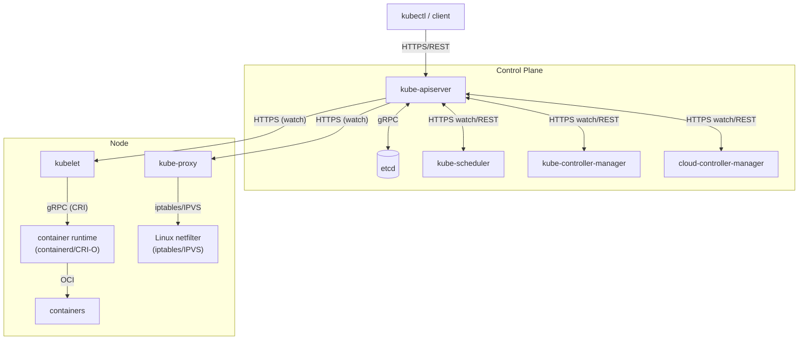
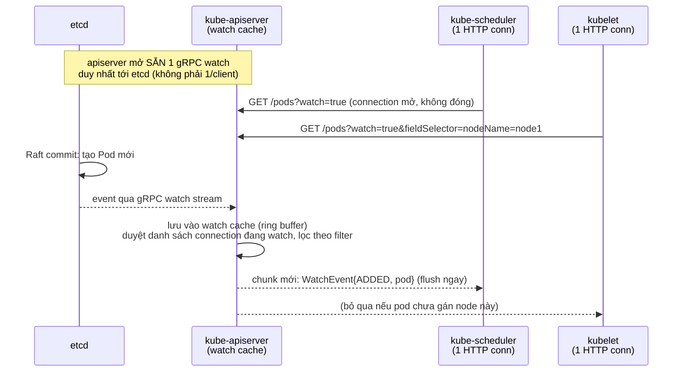

# Kubernetes Components in Detail

Tài liệu này mô tả chi tiết từng thành phần trong cluster Kubernetes, vai trò của chúng trong một chu kỳ (cycle) vận hành thực tế, cách chúng giao tiếp với nhau (giao thức, API), và với etcd — schema lưu trữ dữ liệu trông như thế nào.

---

## 1. Tổng quan kiến trúc



Kubernetes được chia làm 2 nhóm:
- **Control Plane**: ra quyết định (scheduling, reconciliation, lưu trạng thái).
- **Node (Data Plane)**: thực thi workload thực tế (chạy container, network routing).

---

## 2. Control Plane Components

### 2.1. kube-apiserver

**Vai trò**: Cổng giao tiếp duy nhất (front-door) của cluster. Mọi thao tác đọc/ghi trạng thái cluster đều phải đi qua đây — kể cả các control-plane component khác cũng không truy cập etcd trực tiếp.

**Chức năng chính**:
- Expose REST API (`/api/v1/...`, `/apis/<group>/<version>/...`)
- Authentication (client cert, bearer token, OIDC...)
- Authorization (RBAC, ABAC, Webhook)
- Admission Control (Mutating/Validating Webhooks, ví dụ: gán default resource limit)
- Validate schema của object trước khi ghi vào etcd
- Là **watch broker**: cho phép các client (scheduler, kubelet, controller) "subscribe" để nhận thay đổi theo thời gian thực

**Giao tiếp**:
| Với | Giao thức | Chi tiều |
|---|---|---|
| kubectl / clients | HTTPS/REST (JSON hoặc Protobuf) | Request-response thông thường |
| etcd | gRPC | apiserver là client duy nhất của etcd |
| scheduler, controller-manager, kubelet | HTTPS + Watch (long-lived HTTP connection, chunked transfer, **không dùng WebSocket** cho watch — dùng HTTP/1.1 chunked hoặc HTTP/2 streaming) | Server gửi event (`ADDED`, `MODIFIED`, `DELETED`) theo `resourceVersion` |

> Lưu ý sửa lại so với file "5. How does it work.md": watch API của Kubernetes **không** nâng cấp lên WebSocket theo mặc định — nó dùng HTTP chunked streaming (`Transfer-Encoding: chunked`) hoặc HTTP/2. WebSocket chỉ được dùng cho các API đặc biệt như `kubectl exec`, `attach`, `port-forward`.

#### 2.1.1. Cơ chế Watch qua HTTP — subscribe kiểu gì mà chỉ dùng HTTP?

HTTP vốn là request/response, không phải pub/sub. Nhưng Kubernetes không cần một message broker riêng — nó "lách" bằng cách giữ **một request GET duy nhất mở mãi mãi**, chứ không phải publish qua kênh riêng.

**1. HTTP không bắt buộc phải đóng connection sau 1 response**

Với `Transfer-Encoding: chunked` (HTTP/1.1) hoặc DATA frame (HTTP/2), server có thể:
- Trả response header ngay (`200 OK`)
- **Không kết thúc phần thân response** — cứ giữ connection mở, viết thêm "chunk" mới bất cứ khi nào có sự kiện, và gọi `Flush()` để đẩy ngay xuống socket
- Không bao giờ gửi chunk kết thúc cho tới khi client tự ngắt hoặc timeout

Phía client (`client-go`): thay vì đọc hết body rồi mới xử lý, nó dùng một **streaming decoder** đọc từng object JSON/Protobuf ngay khi vừa xuất hiện trên socket, không đợi EOF.

→ Kết quả: 1 TCP connection mở lâu dài, server đẩy dữ liệu bất cứ lúc nào nó muốn — về bản chất giống hệt **SSE (Server-Sent Events)**. Không cần WebSocket vì watch chỉ cần 1 chiều (server → client); WebSocket chỉ cần khi giao tiếp phải 2 chiều (VD: `kubectl exec`).

**2. "Publish" không phải broadcast qua broker — apiserver tự lặp qua các connection đang mở**



Điểm mấu chốt: **apiserver không mở watch riêng tới etcd cho từng client**. Nó chỉ giữ **1** watch stream với etcd, rồi tự fan-out (nhân bản) event đó ra cho N client HTTP watcher khác nhau (mỗi client giữ 1 socket riêng của chính nó). Nếu không có bước cache/fan-out này, hàng nghìn client watch cùng lúc sẽ tạo hàng nghìn watch riêng xuống etcd — không scale nổi.

**3. Resilience khi mất kết nối**

Mỗi event có `resourceVersion`. Nếu socket bị đứt (network blip, apiserver restart, hoặc watch tự timeout sau ~30 phút mặc định), client-go phát hiện lỗi đọc → mở lại watch mới với `resourceVersion=<cái cuối cùng nhận được>` để resume tiếp, không mất event. Nếu resourceVersion đó đã bị etcd nén mất (quá cũ) → apiserver trả `410 Gone` → client buộc phải LIST lại toàn bộ để resync rồi mở watch mới.

---

### 2.2. etcd

**Vai trò**: Database duy nhất lưu trạng thái toàn cluster (source of truth). Là distributed key-value store, dùng thuật toán đồng thuận **Raft** để đảm bảo consistency giữa các node etcd (thường chạy 3 hoặc 5 node để có quorum).

**Đặc điểm**:
- Chỉ `kube-apiserver` được phép nói chuyện trực tiếp với etcd.
- Giao tiếp qua **gRPC** (etcd v3 API).
- Hỗ trợ **watch** ở tầng key-value — đây là nền tảng để apiserver expose watch API lên trên.

**Schema (etcd v3 key-value)**:

etcd không có "table" như RDBMS. Nó là flat key-value store, nhưng Kubernetes tổ chức key theo namespace path có cấu trúc:

```
/registry/<resource>/<namespace>/<name>        → namespaced resources
/registry/<resource>/<name>                    → cluster-scoped resources
```

Ví dụ thực tế các key:

```
/registry/pods/default/nginx-7d9f8c5b6-abcde
/registry/deployments/default/nginx
/registry/services/default/kubernetes
/registry/services/specs/default/my-svc
/registry/namespaces/default
/registry/secrets/default/my-secret
/registry/configmaps/default/my-config
/registry/nodes/worker-01
/registry/replicasets/default/nginx-7d9f8c5b6
/registry/events/default/nginx.abc123
/registry/leases/kube-node-lease/worker-01
```

**Value** ứng với mỗi key là **object Kubernetes được serialize** — mặc định bằng **Protobuf** (không phải JSON, dù apiserver có thể trả JSON cho client). Format value thô:

```
k8s\0 + protobuf-encoded(runtime.Object với TypeMeta + ObjectMeta + Spec + Status)
```

Mỗi object có field quan trọng để tracking version:
```yaml
metadata:
  resourceVersion: "12345"   # map tới etcd's mod_revision, dùng cho optimistic concurrency control
  uid: "a1b2c3..."
  generation: 3               # tăng mỗi khi spec thay đổi (không tăng khi chỉ status đổi)
```

**Cơ chế ghi (write path)**:
1. apiserver nhận request `PUT /api/v1/namespaces/default/pods/nginx`
2. Validate + admission control
3. apiserver gọi etcd `Txn` (transaction) với điều kiện so khớp `mod_revision` hiện tại (optimistic lock — tránh ghi đè lẫn nhau khi có 2 client cùng sửa)
4. etcd Raft-replicate thay đổi tới các node etcd khác → commit khi đạt quorum
5. etcd trả về `mod_revision` mới → apiserver cập nhật `resourceVersion` → trả response cho client, đồng thời **notify tất cả watcher** đang subscribe

**Bảo mật**: dữ liệu trong etcd (đặc biệt `Secret`) nên bật **encryption at rest** (`EncryptionConfiguration`), vì mặc định etcd lưu Secret dưới dạng base64 (không mã hoá thật).

---

### 2.3. kube-scheduler

**Vai trò**: Gán Pod chưa có `spec.nodeName` vào một Node phù hợp.

**Chu trình hoạt động**:
1. **Watch** apiserver để tìm Pod có `status.phase = Pending` và `spec.nodeName = ""`
2. **Filtering (Predicates)**: loại các Node không đủ điều kiện (thiếu resource, taint không match toleration, nodeSelector/affinity không khớp...)
3. **Scoring (Priorities)**: chấm điểm các Node còn lại (ưu tiên node ít tải, spread across zone...)
4. Chọn Node điểm cao nhất → gửi **Binding** request lên apiserver: `POST /api/v1/namespaces/{ns}/pods/{name}/binding`
5. apiserver ghi `spec.nodeName` vào etcd

**Giao tiếp**: chỉ nói chuyện với `kube-apiserver` qua HTTPS REST + Watch — **không** nói chuyện trực tiếp với kubelet hay etcd.

---

### 2.4. kube-controller-manager

**Vai trò**: Chạy nhiều **control loop** (reconciliation loop) độc lập, mỗi loop đảm bảo "actual state" tiệm cận "desired state". Đây là nơi hiện thực hoá triết lý **declarative + reconcile** của K8s.

Một số controller quan trọng chạy bên trong:
| Controller | Nhiệm vụ |
|---|---|
| Deployment Controller | Đảm bảo số ReplicaSet đúng theo rolling update strategy |
| ReplicaSet Controller | Đảm bảo đúng số Pod replica |
| Node Controller | Theo dõi heartbeat (Lease) của Node, đánh dấu `NotReady`/evict pod nếu node chết |
| Endpoint(Slice) Controller | Đồng bộ danh sách Pod IP đứng sau 1 Service |
| Namespace Controller | Dọn resource khi namespace bị xoá |
| ServiceAccount/Token Controller | Sinh token cho ServiceAccount |

**Vòng lặp chuẩn (mỗi controller đều theo pattern này)**:
```
watch (informer cache) → so sánh desired vs actual → nếu lệch → gọi API tạo/sửa/xoá resource
```

**Giao tiếp**: chỉ qua `kube-apiserver` (watch + REST). Dùng cơ chế **Informer/Lister** (client-go) để cache resource cục bộ, giảm tải cho apiserver thay vì poll liên tục.

---

### 2.5. cloud-controller-manager (nếu chạy trên cloud)

**Vai trò**: Tách logic phụ thuộc cloud provider (AWS/GCP/Azure...) ra khỏi controller-manager lõi. Quản lý: LoadBalancer Service (tạo cloud LB), Node lifecycle (xoá Node khi VM bị terminate), Route (cấu hình routing table).

---

## 3. Node Components (Data Plane)

### 3.1. kubelet

**Vai trò**: "Cánh tay" của control plane trên mỗi Node — biến Pod spec thành container thực tế đang chạy.

**Chu trình hoạt động (Sync Loop)**:
1. **Watch** apiserver: `GET /api/v1/pods?watch=true&fieldSelector=spec.nodeName=<this-node>`
2. Khi thấy Pod mới được gán vào Node của mình → gọi **PLEG (Pod Lifecycle Event Generator)** để đối chiếu
3. Gọi **CRI (Container Runtime Interface)** qua **gRPC** tới container runtime (containerd/CRI-O) để:
   - Pull image (nếu chưa có)
   - Tạo sandbox (pause container giữ network namespace)
   - Tạo container theo OCI spec
4. Gọi **CNI plugin** (thường qua exec binary, không phải network call) để cấp phát IP, thiết lập network namespace
5. Thực hiện **liveness/readiness/startup probes** định kỳ (HTTP GET, TCP socket, exec command)
6. Báo cáo status ngược lại apiserver: `PATCH /api/v1/namespaces/{ns}/pods/{name}/status`
7. Gửi **Node heartbeat** định kỳ qua object `Lease` (namespace `kube-node-lease`) — nhẹ hơn nhiều so với update toàn bộ Node object

**Giao tiếp**:
| Với | Giao thức |
|---|---|
| kube-apiserver | HTTPS REST + Watch (client cert `kubelet.crt`/`kubelet.key`) |
| Container runtime | **gRPC qua Unix domain socket** (`/run/containerd/containerd.sock`) theo chuẩn **CRI** |
| CNI plugin | Thực thi binary trực tiếp (exec), truyền config qua JSON stdin |
| CSI plugin (storage) | gRPC qua Unix socket, chuẩn **CSI (Container Storage Interface)** |

---

### 3.2. kube-proxy

**Vai trò**: Hiện thực hoá `Service` — route traffic đến đúng backend Pod, cân bằng tải ở tầng L3/L4.

**Chu trình hoạt động**:
1. Watch apiserver để lấy danh sách `Service` và `EndpointSlice`
2. Với mỗi thay đổi, viết lại rule ở tầng kernel:
   - **iptables mode** (phổ biến trước đây): tạo chain `KUBE-SERVICES`, `KUBE-SVC-*`, dùng `iptables -j DNAT` để chuyển ClusterIP → Pod IP, chọn ngẫu nhiên theo xác suất (`--probability`)
   - **IPVS mode** (hiệu năng cao hơn với cluster lớn): dùng Linux IPVS (virtual server) để load-balance, hỗ trợ nhiều thuật toán (round-robin, least-conn...)
   - **nftables mode** (bản mới hơn thay iptables)

**Giao tiếp**: chỉ watch `kube-apiserver`; giao tiếp với dữ liệu thực tế là **thao tác trực tiếp vào Linux kernel netfilter/IPVS table**, không qua network call.

---

### 3.3. Container Runtime (containerd / CRI-O)

**Vai trò**: Thực thi container thật sự — pull image, unpack layer (theo OCI Image Spec), tạo container process (theo OCI Runtime Spec, thường thông qua `runc`).

**Giao tiếp**: nhận lệnh từ kubelet qua **CRI gRPC API** (`RunPodSandbox`, `CreateContainer`, `StartContainer`...); bên dưới gọi `runc` (hoặc `crun`, `kata`...) bằng cách exec + OCI bundle trên filesystem.

---

## 4. Full Cycle Ví Dụ: Deploy 1 Pod qua Deployment

Ví dụ trọn vẹn 1 cycle khi bạn chạy `kubectl apply -f deployment.yaml` (1 replica), thể hiện rõ vai trò + giao thức từng bước:

| Bước | Thành phần | Hành động | Giao thức |
|---|---|---|---|
| 1 | kubectl | Đọc file YAML, serialize | — |
| 2 | kubectl → apiserver | `POST /apis/apps/v1/namespaces/default/deployments` | HTTPS REST |
| 3 | apiserver | Auth + Admission + Validate | — |
| 4 | apiserver → etcd | Ghi object `Deployment` | gRPC |
| 5 | Deployment Controller | Watch thấy Deployment mới → tạo `ReplicaSet` | Watch (HTTPS) → REST POST |
| 6 | ReplicaSet Controller | Watch thấy ReplicaSet mới → tạo `Pod` (status Pending, chưa có nodeName) | Watch → REST POST |
| 7 | apiserver → etcd | Ghi object `Pod` | gRPC |
| 8 | kube-scheduler | Watch thấy Pod Pending không có node → filter + score node → Bind | Watch → REST POST (binding) |
| 9 | apiserver → etcd | Update `Pod.spec.nodeName` | gRPC |
| 10 | kubelet (trên node được chọn) | Watch thấy Pod gán cho mình | Watch (HTTPS) |
| 11 | kubelet → containerd | Tạo sandbox + container | gRPC (CRI) qua Unix socket |
| 12 | kubelet → CNI plugin | Gán IP cho Pod | exec binary |
| 13 | containerd → runc | Start container process thật | OCI exec |
| 14 | kubelet | Probe container, cập nhật status `Running` | — |
| 15 | kubelet → apiserver | `PATCH` Pod status | HTTPS REST |
| 16 | apiserver → etcd | Ghi status mới | gRPC |
| 17 | Endpoint Controller | Watch Pod Running + có IP → cập nhật `EndpointSlice` | Watch → REST |
| 18 | kube-proxy (mọi node) | Watch EndpointSlice mới → cập nhật iptables/IPVS rule | Watch → kernel netfilter |

**Điểm mấu chốt**: mọi thành phần **không** giao tiếp trực tiếp với nhau (trừ kubelet ↔ CRI/CNI và kube-proxy ↔ kernel). Tất cả đi qua `kube-apiserver` theo mô hình **watch-based reconciliation**, apiserver là hub duy nhất, etcd là nguồn sự thật duy nhất.

---

## 5. Bảng tổng hợp giao thức

| Cặp giao tiếp | Giao thức | Kiểu kết nối |
|---|---|---|
| Client ↔ apiserver | HTTPS/REST (JSON/Protobuf) | Request-response hoặc Watch (chunked streaming) |
| apiserver ↔ etcd | gRPC | Persistent connection |
| Controller/Scheduler ↔ apiserver | HTTPS + Watch | Long-lived, informer cache |
| kubelet ↔ apiserver | HTTPS + Watch | Long-lived, mTLS client cert |
| kubelet ↔ container runtime | gRPC (CRI) | Unix domain socket |
| kubelet ↔ CNI | exec + JSON stdin | Local process call |
| kubelet ↔ CSI | gRPC (CSI) | Unix domain socket |
| kube-proxy ↔ kernel | syscall (iptables/ipvs/nft) | Local |
| kubectl exec/attach/port-forward | SPDY hoặc WebSocket | Long-lived bidirectional stream |

---

## 6. Ghi chú thêm

- **Informer pattern**: hầu hết mọi component (scheduler, controller-manager, kubelet) không gọi API liên tục — chúng dùng `client-go` Informer để giữ 1 local cache đồng bộ qua watch, giảm tải cho apiserver rất nhiều.
- **resourceVersion** chính là cơ chế optimistic concurrency: mọi update phải kèm resourceVersion hiện tại, nếu etcd đã thay đổi (do request khác ghi trước) thì apiserver trả lỗi `409 Conflict`, client phải fetch lại rồi thử lại.
- **Level-based, không phải edge-based**: watch có thể miss event (network drop), nên mọi controller đều thiết kế để tự resync định kỳ (List lại toàn bộ) — đảm bảo hệ thống tự phục hồi dù có event bị lỡ.
